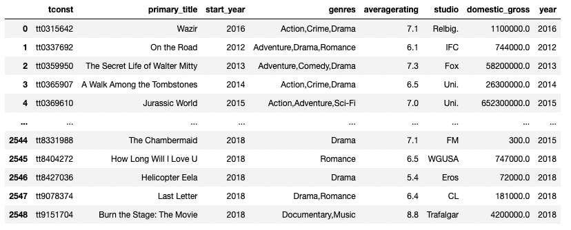
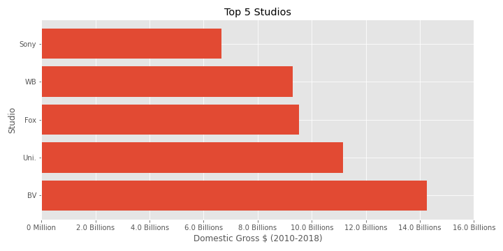
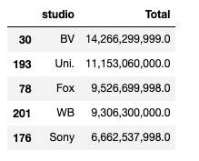
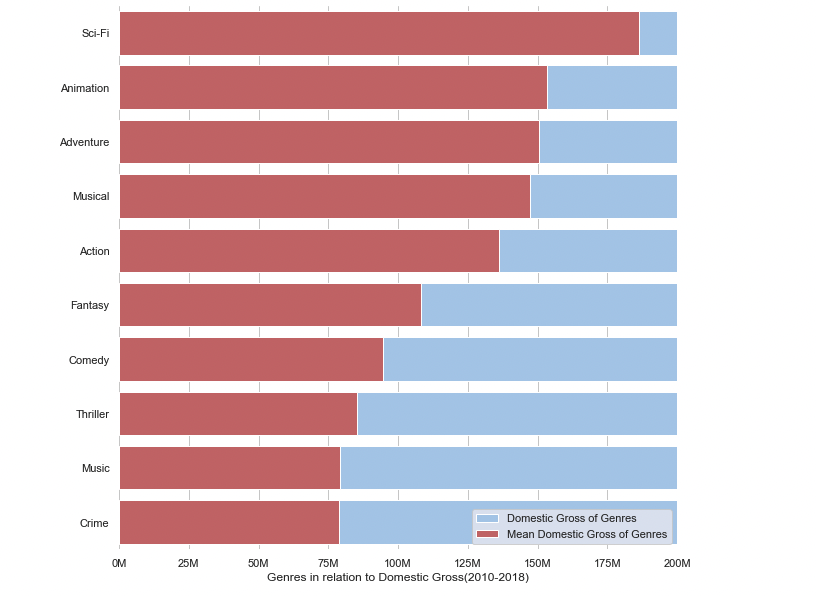
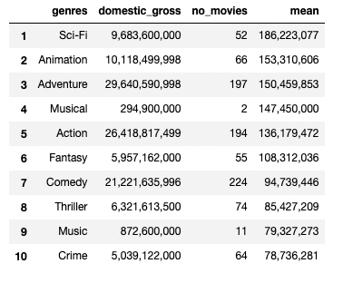
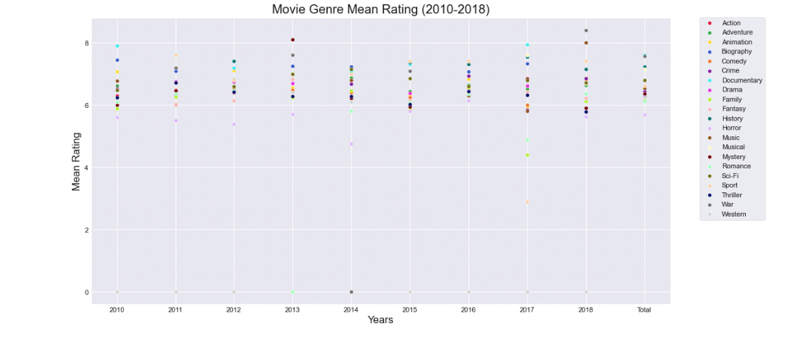

# Microsoft Movie Studio Analysis

**Author**: Chris Freyre

## Overview

The business problem is that Microsoft want to create a new movie studio. They need recommendations, so they can choose the right type of films. 

For this project I have decided to use the following data sets: Imdb.title.basics, Imdb.title.ratings, bom.movie_gross. In these data sets, each one has a common data point so I merged them together to provide a more clean and complete data set. Through analysis of this data, I've created 3 business recommendations in relation to movie studios: The top 5 movie studios, the movie genres with the highest domestic gross and movie genres with the highest ratings. 

## Business Problem

Microsoft are unaware of what type of movies to create in their new movie studio. For this we need to ask ourselves the best way to approach this project, would be with 3 different points of view, which are 1. top movies studios, 2. top genres from these top movie studios and 3. top genres in relation to ratings. 

With question one we will be pointed in the right direction following a successful company proven to perform well with a total domestic gross higher than other movie studios. Question two will have a pattern of genres in these movie top sellers. Finally question three will use the same pattern but from the viewers perspective voting for the type of movies that they love that would be correlated with the top movies in the market.

I will create solutions from the data set provided, having 3 different points of view: Business perspective from the data of other movie studios performance with their own domestic gross, then match that result to the top genre movies from the other data sets and combine them with the perspective of the viewers through the top rated movies. 

Microsoft has this data but all separated or messy data, so it makes it hard to read, that's why I not only joined 3 datasets together, but before merging them I cleaned them all, for a better performance now and for the future.

## Data

We had a dataset with domestic gross that would solve our question number one, then we merged it with movie titles because it has all the data from the movie genres, names, etc that would compliment our answer about top genres. I then merged this with the last dataset of ratings. So top genres, top movies and top movie studios were all linked.

## Methods

I found the common data points in each dataset where I could merge them, for example I knew that I needed to merge the movie title dataset with gross dataset from the common 'primary titles' data point. I then merged them with the ratings dataset using the common 'tconst' data point, I also cleaned the data along the way. That way I could have a solid dataset that would give me a clean answer for not only my questions also for future ones.

### Merge of Dataset in one


## Results

Out of my main dataset where I merged them all, I saw that with the top 5 movies, the movie studio BV had 4 of them, proving that top titles, domestic gross and movie studios were all linked. 

I'm confident because I not only matched results from one side, also from three different points of view; business, product and client. 

Below are the charts I've created to show my results.

### `Top 5 movie studios in terms of domestic gross`





### `Top genres in terms of domestic gross`



 
### `Mean genre by rating`


## Conclusion
In summary I would recommend to produce movies based on Sci-fi, Animation and/or Adventure, not only because they possess good ratings, also they seem to be a great combination for movies that are earning a great domestic gross, as proven from the top 5 movie studios, and top movie genre domestic gross.

I recommend following in the footsteps of Buena Vista International (BV) Studios in how they approach movies since they have been a good example to follow, being the most profitable with less movies in comparison to the other top 5 movie studios.

My analysis is only based on domestic gross, which can be slightly limiting. So future improvements could include analysing foreign gross to expand the dataset, this would help give a broader view on the recommendations. I intend to get more familiar with the functions used to simplify my process of coding and speed things up.

## For More Information

Please review my full analysis in my Jupyter notebooks or my presentation as detailed below.

For any additional questions, please contact me.


## Repository Structure

```
├── README.md                           <- The top-level README for reviewers of this project
├── Microsoft_recommendations.ipynb     <- Narrative documentation of recommendations in Jupyter notebook
├── microsoft_slides.pdf                <- PDF version of project presentation
├── microsoft_presentation.mp4              <- Video presentation
├── data                                <- Both sourced externally and generated from code
└── images                              <- Both sourced externally and generated from code
```
